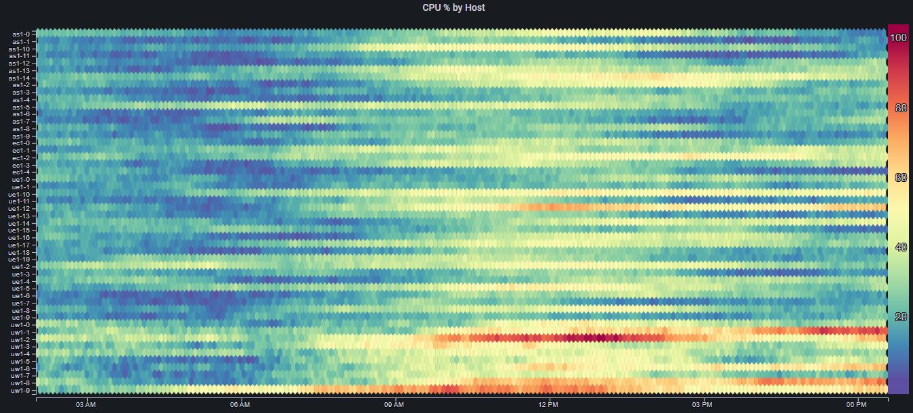
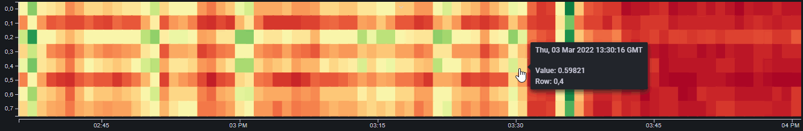
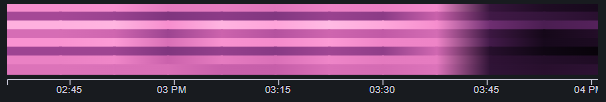

# Features

## Grouping

By specifying a [`Group` field](configuration_options.md#fields), different series/rows can be grouped according to common values
 
This has the following effects:
<ul>
<li>Sorting is performed on each group first, and then by Breakdown field</li>
<li>Groups of rows can be visually separated using the Group Spacing field</li>
<li>Row labels can show only the group names, instead of all of the specific rows</li>
</ul>

For example, lets say we have CPU utilization data for 50 different hosts, running in 5 different regions
 
The heatmap will look something like this:

Even though the rows are sorted such that they are effectively grouped by region (only because of the hosts' naming convention), it is still quite hard to distinguish between the different groups/regions, and be able to say something meaningful about the overall performance/trends in each region

By using the `Region` label as the `Group` field, as well as applying some `Group Spacing`, we get:

This very minor change in the visualization makes a big difference in our ability to reason about the trends in different regions
Since we are mainly concerned with the overall regional performance, we can change the [`Show Labels` field](configuration_options.md#labels) to `Group` to get:

If we need to see the label for a specific row/host, we can always just hover over that row and see the tooltip data:

## Focus

The number of columns in a Mosaic Plot determines its resolution.  Ideally, we would always show the maximum number of columns (which would be the number of data points in the underlying data).  However, showing too many cells can impact the web page's performance
To address this, the [`Min Columns`](configuration_options.md#grid-properties) field can be used to limit the number of columns that are displayed
In some cases however, we might want to show panels with a limited number of columns, but then be able to (maybe temporarily) increase that number so we can get a higher resolution and notice more detail

To enable this interactivity, the [`Enable Focus`](configuration_options.md#style) option must be enabled.  Once it is enabled, clicking on any part of the panel will cause it to transition between the values in [`Min Columns`](configuration_options.md#grid-properties) and [`Max Columns`](configuration_options.md#grid-properties)

## Smoothing

When the [`Smoothing`](configuration_options.md#style) option is enabled, instead of simply coloring each cell according to its value, each cell is colored with a gradient, spanning from the color in the cell's left neighbor, to the cell's color
Smoothing can make low resolution plots appear nicer, as well as remove visual artficats caused by arbitrary division of the data into cells:

